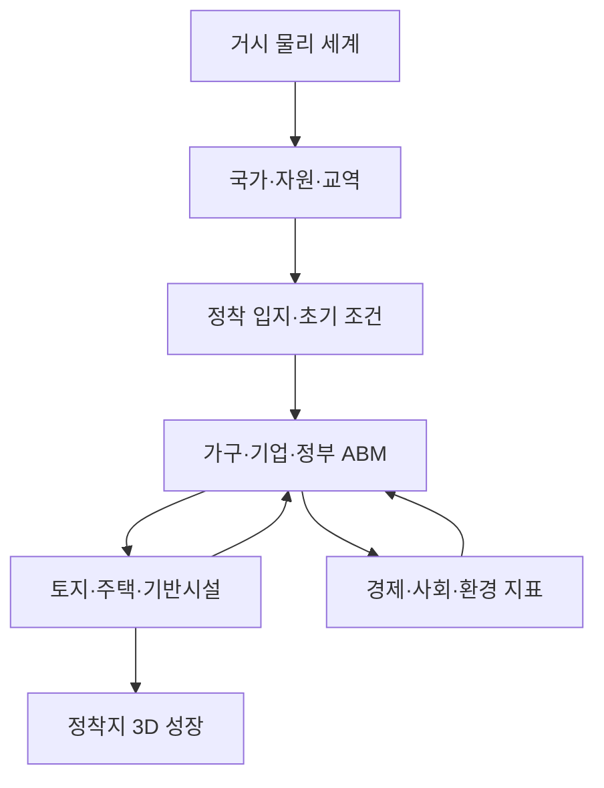
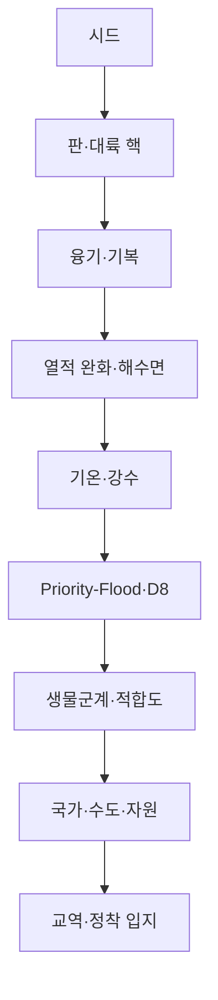

# Procedural City v2.0 시스템 아키텍처

## 1. 전체 구조



모델은 `거시 세계`, `정착지 사회`, `정착지 공간`, `다중 해상도 렌더러` 네 계층으로 분리한다. 각 계층은 다른 해상도와 시간 간격을 사용하지만 시드와 명시적 데이터 계약으로 연결된다.

## 2. 공간·시간 척도

| 계층 | 공간 척도 | 시간 척도 | 주요 객체 |
|---|---|---|---|
| 거시 물리 | 96 × 96, 약 25.3 km/셀 | 생성 시 정적 | 판, 고도, 기온, 강수, 생물군계, 하천 |
| 국가·교역 | 국가 8~14개 | 1년 | 국가, 정부 형태, 자원, 거시경제, 교역 회랑 |
| 정착지 사회 | 가구·기업 및 집계 재고 | 1개월 | 가구, 기업, 노동, 시장, 지방정부, 시설 |
| 정착지 공간 | 약 0.84 km, 1 m 단위 | 건설·사업 준공 시 | 도로, 필지, 건물, 공원, 교량, 대중교통 |
| 렌더링 | 거시 1 unit≈1 km / 미시 1 unit=1 m | 프레임 | WebGL 정점 버퍼, 카메라, 날씨, LOD |

## 3. 데이터 계약

### 3.1 World

```js
World {
  schemaVersion: 7,
  seed,
  size, spanKm, cellKm,
  fields: {
    elevation, plateId, uplift,
    temperature, precipitation, moisture, biome, slope,
    distanceToOcean,
    hydrology: { filled, downstream, accumulation, river }
  },
  countries[],
  countryId[], border[],
  trade[],
  settlement,
  diagnostics
}
```

### 3.2 Country

```js
Country {
  id, name, capitalIndex, capital,
  governmentSystem,
  taxRate, publicInvestmentRate,
  tradeOpenness, institutionalQuality,
  cells, areaKm2, ports,
  population, gdpPerCapita, gdp,
  resources: { agriculture, timber, minerals, energy, hydro }
}
```

### 3.3 Society state

```js
SocietyState {
  year, month, elapsedMonths,
  population,
  households[], householdCount,
  firms[],
  macro, labor, economy, housing,
  government, utilities, services,
  environment, development, politics,
  flows, history[], events[], diagnostics
}
```

### 3.4 Render layers

```js
RenderLayers {
  terrain: Float32Array,
  roads: [{ id, class, role, points, vertices }],
  buildings: [{ id, parcelId, frontageRoadId, program, floors, vertices }],
  natural: Float32Array,
  transit: Float32Array
}
```

건물과 도로를 개별 정점 청크로 보존하므로 사회 엔진이 건설한 수량만 3D 장면에 나타난다. 완성 도시 전체 정점 버퍼를 투명하게 가리는 방식이 아니다.

## 4. 거시 세계 생성 파이프라인



### 물리 불변식

- 해양 셀은 국가에 배정하지 않는다.
- 정착지는 양의 고도, 유효 국가, 최소 적합도 조건을 만족한다.
- 배수 보정 고도에서 하류는 상류보다 높아지지 않는다.
- 동일 시드·설정은 같은 고도·국가·교역·정착 셀을 만든다.

## 5. 사회 엔진

### 5.1 행위자 해상도

초기 정착지는 모든 가구의 가중치가 1이다. 규모가 커지면 브라우저에서 수십만 객체를 유지하지 않고 대표 가구 수를 `sqrt(가구 수)`에 비례해 늘리며 각 가구에 가중치를 부여한다. 기업은 업종별 사업체 객체로 유지한다.

이 방식은 다음을 구분한다.

- `households.length`: 계산에 사용되는 대표 가구 수
- `householdCount`: 도시 전체 가구 재고
- `household.weight`: 대표 가구가 나타내는 실제 가구 수

### 5.2 경제 주체

| 주체 | 핵심 상태 | 주요 선택/결과 |
|---|---|---|
| 가구 | 규모, 근로자, 자녀, 교육, 소득, 저축, 점유 형태, 만족도 | 노동 공급, 소비, 주거비 부담, 정착 만족도 |
| 기업 | 업종, 고용, 생산성, 자본, 현금, 생산, 매출, 이윤 | 고용 조정, 재투자, 진입, 손실 누적 퇴출 |
| 지방정부 | 조세율, 현금, 부채, 세입·세출, 지지율, 우선순위 | 시설 착공, 유지관리, 차입, 선거 후 우선순위 변경 |
| 국외/국가 | 거시 성장, 금리, 물가, 제도, 개방도 | 수입 부족분 완충, 수출시장, 이전재원, 이주 풀 |

### 5.3 업종

`농림·식품 / 자재 / 건설 / 소매 / 생활 서비스 / 제조 / 물류 / 에너지`

업종별 생산은 노동·생산성·자본·자원·기반시설 신뢰도·집적 효과를 결합한다. 수요와 공급의 차이는 가격, 수입, 기업 고용과 진입에 영향을 준다.

### 5.4 인구 재고-흐름

매월 다음 항등식을 검사한다.

```text
기말 인구 = 기초 인구 + 출생 - 사망 + 순이동
```

순이동은 임금, 실업, 주택 여유, 주거비, 서비스, 기반시설, 정부 정당성, 재해 피해에 따라 달라진다. 주택 여력이 없으면 양의 이주 잠재력이 있어도 실제 유입이 제한된다.

### 5.5 주택·개발

민간 주택 개발 입력:

- 가구 수와 주택 재고의 차이
- 공실률과 임대료
- 금리·위험 프리미엄
- 토지가격·건설비·물가
- 건설업 노동력
- 진행 중 사업의 시공 용량

준공 시 `housing.units`와 `development.constructedBuildings`가 증가한다. 지어진 건물은 인구가 감소해도 자동 삭제되지 않는다.

### 5.6 공공시설과 발전 시스템

| 시스템 | 수요 | 용량·상태 | 투자 조건 예시 |
|---|---|---|---|
| 전력 | 인구·산업 고용 | MW, 신뢰도, 재생 비중, 유지관리 | 부하율 > 82% |
| 상수 | 인구·산업 고용 | m³/일, 신뢰도 | 부하율 > 82% |
| 하수 | 상수 사용량 | m³/일, 신뢰도 | 부하율 > 84% |
| 폐기물 | 인구·산업 | t/일, 신뢰도 | 용량 초과 경고·유지관리 |
| 배수 | 불투수율·홍수 노출 | 축약 용량, 신뢰도 | 부하율 > 78% 또는 고노출 |
| 교육 | 아동 인구 | 학교 좌석 | 좌석 < 수요 × 1.08 |
| 보건 | 전체 인구 | 진료 수용력 | 수용력 < 인구 × 1.03 |
| 응급 | 전체 인구 | 대응 수용력 | 접근성 지표에 반영 |
| 공원 | 전체 인구·개발지 | ha, 접근성 | 1인당 면적 부족 |

공공사업은 착공비·잔금·공사기간을 가지며, 정부 현금이 부족하면 동시에 모두 건설되지 않는다.

### 5.7 정치·환경

정부 지지율은 서비스, 기반시설, 고용, 주택, 환경, 부채의 함수다. 선거 주기마다 지지율이 낮으면 가장 취약한 부문의 예산 우선순위를 높인다.

환경은 에너지·산업·인구에서 배출을 계산하고, 폐기물·하수 신뢰도와 불투수율을 대기·수질·생태 건강에 연결한다. 강우 사건에서 유출, 배수 부족, 입지 홍수 노출이 합쳐지면 재산 피해와 정부 지출이 발생한다.

## 6. 3D 성장 연결

1. v1.1 엔진이 지형·도로·필지·최종 잠재 건물의 의미 객체와 정점 청크를 만든다.
2. v2.0이 저층·주거·중심 접근성을 기준으로 개발 순서를 결정한다.
3. 사회 엔진의 실제 `constructedBuildings`만 활성화한다.
4. 활성 건물의 `frontageRoadId`를 읽어 필요한 도로 회랑을 함께 활성화한다.
5. 나머지 도로는 개발지 비율과 위계·중심 접근성에 따라 단계적으로 열린다.
6. 인구·재정 조건이 맞아 대중교통이 개통되면 철도·역 정점 청크를 추가한다.

초기 기준 시드는 7개 건물과 5개 도로 회랑만 렌더링한다. 잠재 완성 장면은 175개 건물과 76개 도로 회랑을 가진다.

## 7. 파일 구조

```text
src/
├── v2-world-system.js.txt       # 물리 세계·국가·교역
├── v2-society-engine.js.txt     # 월별 사회·경제·환경 ABM
├── v2-render-bridge.js.txt      # 거시 3D와 성장 정점 조립
├── v2-ui-controller.js.txt      # 실행·속도·세계/정착지 UI
├── v2-living-world.css          # v2 대시보드 스타일
└── v11-render-pipeline.js.txt   # 도로·건물 정점 청크 제공

scripts/
├── test-v2-world.mjs
├── test-v2-society.mjs
└── test-v2-integration.mjs
```

## 8. 성능 전략

- 거시 세계는 9,216셀과 약 60,000 정점으로 제한한다.
- 국가·교역은 집계 객체로 계산한다.
- 가구는 규모 증가 시 대표 가중치 방식으로 전환한다.
- 건물·도로 정점은 건설 상태가 달라질 때만 다시 합친다.
- 매 프레임에는 카메라·광원·동적 차량만 갱신한다.
- 동일 시드의 정적 세계와 공간 결과를 재사용할 수 있는 구조다.

후속 성능 단계는 Web Worker, 공간 타일, GPU 인스턴싱, 시야 절두체 컬링이다.
