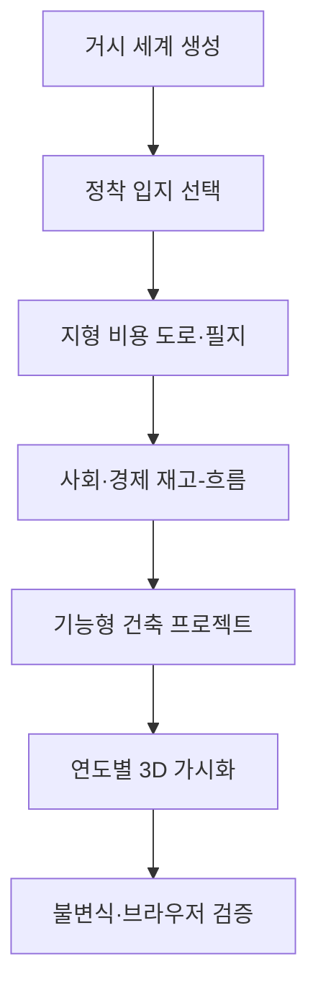

# V3 전면 재구축 기록

## 1. 자료조사 계획

이번 재구축은 화면 장식보다 먼저 다음 질문을 검증하는 순서로 진행했다.

1. 국가 규모와 정착지 규모를 같은 메시 하나로 그리지 않고 어떻게 분리할 것인가.
2. 도로를 격자 장식이 아닌 지형·수계·기능 비용의 결과로 만들 수 있는가.
3. 건물을 단순 상자가 아닌 의미·기능·재질을 가진 객체로 유지할 수 있는가.
4. 인구 그래프에 건물을 맞추는 대신 재고와 제약이 실제 성장량을 결정하게 할 수 있는가.
5. 초기부터 최종까지 한 화면에서 직접 보고 조작하면서도 UI가 도시를 가리지 않게 할 수 있는가.

조사 범위는 지리 데이터, 대규모 3D 전송, 도시 의미 모델, 도로 설계, 경제·환경 회계, 웹 렌더링으로 제한했다.

## 2. 자료조사 결과와 설계 반영

| 근거 | 조사 결과 | V3 반영 |
|---|---|---|
| [OGC CityGML 3.0](https://www.ogc.org/standards/citygml/) | 건물뿐 아니라 도로·교량·수역·식생·도시가구를 의미 객체로 다룬다. | 도로·필지·건축·식생을 각각 ID와 기능을 가진 객체로 분리했다. |
| [OGC 3D Tiles](https://www.ogc.org/standards/3dtiles/) | 대규모 3D 지리 콘텐츠는 계층형 타일과 LOD로 스트리밍해야 한다. | 현재는 세계/정착지 2단계 LOD를 분리했고, 행성 규모 확장은 타일 스트리밍 단계로 남겼다. |
| [Copernicus DEM](https://dataspace.copernicus.eu/explore-data/data-collections/copernicus-contributing-missions/collections-description/COP-DEM) | GLO-30/GLO-90은 전 지구 DSM을 제공하며 수역·해안 편집이 포함된다. | V3의 합성 지형 API를 고도 샘플러로 분리해 이후 DEM 타일로 교체할 수 있게 했다. 현재 데이터 자체는 합성이다. |
| [OpenStreetMap 데이터 개요](https://blog.openstreetmap.org/) | 도로·철도·하천·건물·토지이용을 내려받아 경로와 분석에 사용할 수 있다. | 도로와 건물에 전면 도로 ID·등급·기능을 부여했다. 실제 OSM 수입과 ODbL 표시 절차는 후속 단계다. |
| [FHWA 도로 설계 지침](https://highways.dot.gov/federal-lands/pddm/Chapter_09.pdf) | 주요 도로는 3D 설계면, 곡선, 횡단면과 접속부를 함께 다뤄야 한다. | 경사·물·범람 비용의 A* 경로, 스무딩, 도로 등급별 폭·노견·차로, 교량 단면을 생성한다. |
| [2025 SNA](https://unstats.un.org/unsd/nationalaccount/snaupdate/2025/2025_SNA_Combined.pdf) | 경제는 기관 부문과 재고·흐름·회계 규칙으로 기술한다. | 인구·가구·주택·일자리·정부 현금·부채를 연도별 재고로, 출생·사망·이동·세입·비용을 흐름으로 계산한다. |
| [UN SEEA](https://seea.un.org/en/methodology/seea-central-framework) | 환경과 경제의 관계도 같은 회계 틀 안에서 측정해야 한다. | 환경 상태, 산업 비중, 기반시설 신뢰도, 대기질을 성장·재정과 연결했다. 완전한 SEEA 계정은 후속 단계다. |
| [Three.js InstancedMesh](https://threejs.org/docs/pages/InstancedMesh.html) | 동일 형상·재질의 대량 객체는 인스턴싱으로 드로 호출을 줄일 수 있다. | 창호·벽체·지붕·나무·차량·가로등을 인스턴스 묶음으로 렌더링한다. |

## 3. 프로그래밍 계획

- 이전 런타임을 호출하지 않는 `src/v3/` 독립 모듈을 만든다.
- 세계와 정착지는 서로 다른 공간 해상도·카메라·렌더 그룹을 사용한다.
- 시뮬레이션은 0–120년의 121개 스냅샷을 한 번 계산하되, 각 해는 직전 재고와 그 해의 흐름만 사용한다.
- 도로는 수요와 공공재정 조건이 충족될 때 열고, 도로 전면이 없는 필지에는 건물을 배치하지 않는다.
- 건물은 주택·고용·서비스 수용력을 가지며, 입지·비용·공사기간과 기능에 맞는 형태 문법을 사용한다.
- 조작부는 초기/재생/직접 스크럽/최종/속도만 항상 노출하고 나머지는 숨긴다.

## 4. 구현 결과

### 세계 계층

- 3,600km, 128×128 격자
- 13개 판의 대륙성·속도·경계 수렴을 이용한 고도장
- 위도·고도·해양 거리 기반 온도·강수·생물군계
- D8 계열 하류 방향과 유량 누적 기반 하천
- 적합도 기반 12개 국가, 수도, 국경, 18개 교역 회랑
- 선택된 국가·하천 주변의 정착 입지를 지역 좌표계로 연결

### 정착지 공간 계층

- 2.4km 정사각 지역, 160×160 지형 표면
- 하천 계곡·범람지·경사·지표 분류
- 등급별 폭과 속도를 가진 39개 곡선 도로, 2개 교량
- 경사 14도 미만, 수공간 회피, 도로 전면을 보장하는 319개 개발 필지

### 사회·경제 계층

- 초기 42명·14가구·15동·3개 도로
- 출생, 사망, 유입, 유출의 인구 흐름
- 가구, 주택, 공실/부족, 임대 압력
- 노동력, 고용, 일자리 수용력, 생산성, GDP
- 정부 현금, 세입, 운영비, 부채 한도, 상환, 공공투자
- 교육·보건·교통·전력/수도 계열 서비스와 환경 상태
- 주택과 일자리 여유, 시장 접근, 재정, 공사기간이 민간·공공 프로젝트를 결정

### 3D·UI 계층

- 벽돌·미장·콘크리트·기와·금속·유리·아스팔트·흙길·수면의 절차적 재질
- 박공지붕, 세트백, 포디움, 발코니, 캐노피, 창호, 문, 옥상설비, 태양광, 공사 비계
- 도로 노견·보도·차선·교량 난간과 교각
- 식생 제거 연도, 차량, 가로등의 시점별 활성화
- 전체 화면 3D 위에 작은 지표 3개와 하단 타임라인만 상시 표시

## 5. 검토 결론

V3는 이전 구현을 실행 경로에서 제거했고, 초기·중기·최종·세계 장면을 실제 WebGL2 브라우저에서 오류 없이 확인했다. 기준 시드는 120년에 10,635명, 4,395가구, 172개 완공 건축물, 39개 도로로 성장한다. 이 결과는 고정된 건물 수 곡선이 아니라 주택·고용·재정·도로·서비스 제약의 계산 결과다.

다만 “현실 기반”과 “실제 세계 복제”는 구분해야 한다. 현재는 절차적 합성 기반선이며, 다음 항목이 완료되기 전에는 디지털 트윈이라고 부르지 않는다.

1. 실제 좌표계와 Copernicus DEM/국가 DEM 타일 수입
2. OSM 도로·건물·토지이용의 라이선스 준수 수입과 토폴로지 정합
3. CityGML/CityJSON 의미 스키마 및 3D Tiles 계층형 스트리밍
4. 가구·기업·정부·금융·정치 행위자의 명시적 원장과 검정 데이터
5. 교통 배정, 전력·수도·하수·폐기물 네트워크 해석
6. 실측 PBR/사진측량 자산, 내부 공간, 구조·법규·인허가 모델

이 여섯 단계는 외형을 더 화려하게 만드는 작업이 아니라, 모델이 현실을 주장할 수 있게 만드는 검증 관문이다.
